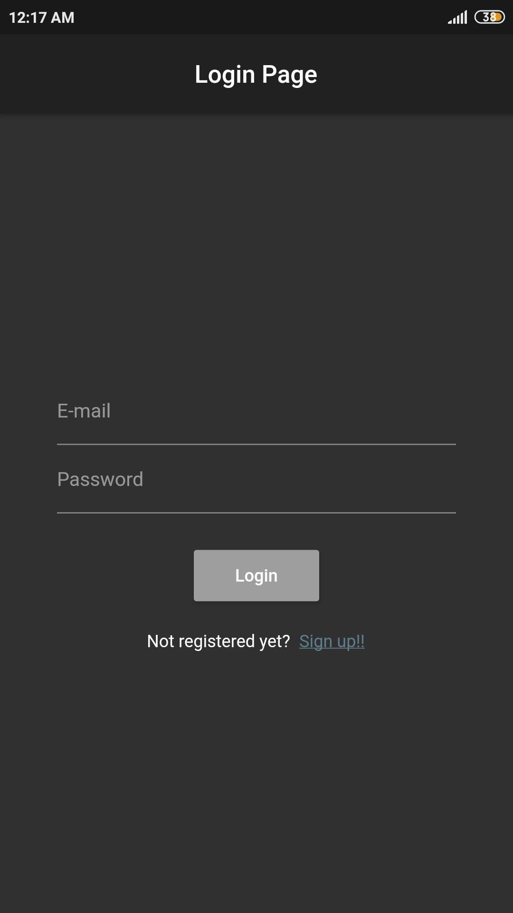
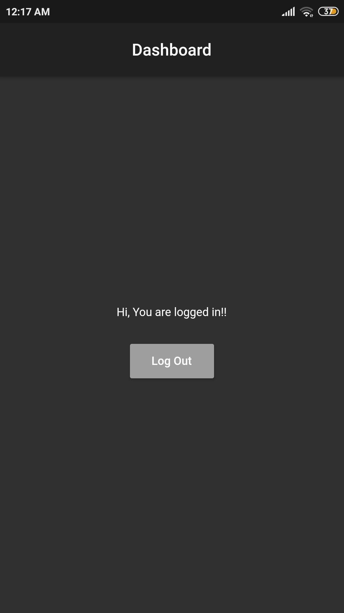

# Login using Email and Password

This app is a basic template for a login form using email and password. UI has been made using Flutter and authentication part has been taken care by Firebase.

## Images
<table>
  <tr>
    <td>Login Screen</td>
     <td>Dashboard</td>
  </tr>
  <tr>
    <td></td>
    <td></td>
  </tr>
 </table>

## Getting Started

This project is a starting point for a Flutter application.

A few resources to get you started if you too want to make cool apps:

- [Lab: Write your first Flutter app](https://flutter.dev/docs/get-started/codelab)
- [Cookbook: Useful Flutter samples](https://flutter.dev/docs/cookbook)

For help getting started with Flutter, view our
[online documentation](https://flutter.dev/docs), which offers tutorials,
samples, guidance on mobile development, and a full API reference.
